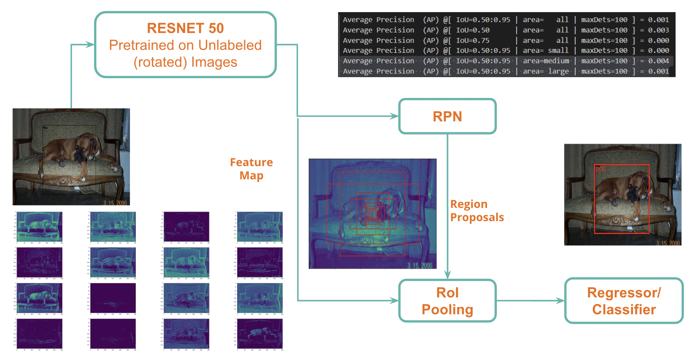

## Intro
The goal of this project is to build a deep-learning model for object detection and classification with creative methods. To overcome the lack of labeled images in Object Detection, our team conducted both supervised and self-supervised experiments to perform image classification and bounding box inference. The results of the bounding boxes were promising. However, our model had a bad performance for classification accuracy.

## Data and Problem
The task of predicting the location of the object along with the class in a given image is called Object Detection. The goal of this problem is to design a model for object detection and to optimize the mAP IoU (0.5:0.95) for bounding boxes. Some of the key characteristics of the given data are as follows:

    - 512,000 unlabeled 224 x 224 colored images
    
    - 30,000 labeled (bounding boxes of 100 classes) training colored images with different sizes
    
    - 20,000 labeled (bounding boxes of 100 classes) validation colored images with different sizes

The object classification for the given training data is an Imbalanced Classification problem of 100 classes. Samples of minority and majority classes are shown here

|Minority           |   Majority    |
|-----------        |-------------  |
|<ul><li>nail 86</li><li>skunk 99</li><li>computer keyboard 102 </li><li>bookshelf 106</li><li>red panda 108</li> </ul>   | <ul><li>watercraft 1038</li><li>car 1171</li><li>bird 4331</li><li>person 4657</li><li>dog 8341</li>

## ResNet50 + Faster RCNN}
For our experiment, we have chosen Faster-RCNN. It has the following key components:

### Backbone
We have chosen ResNet50 as our backbone for FasterRCNN. We have used the unlabeled data for pre-training the backbone using the pretext task of Image Rotation. We first performed a random 70-30 train-val split on the unlabeled data. We rotate each image by 0 / 90 / 180 / 270, and then predict the angle at which the image is rotated using ResNet50 adapted for a 4-class classification problem. We have used Data Augmentation techniques like Guassian-Blur, Sharpness-Adjustment. This backbone is trained from scratch to reach a validation accuracy of 75 percent

### Region Proposal Network (RPN)
RPN takes the output feature maps from the backbone as input. Slides $3 \times 3$ filters over the feature map to make class-agnostic region proposals using a CNN. (As shown in Figure~\ref{model1}) This is in turn fed into two separate fully connected layers to predict boundary box and objectness scores. The objectness measure is higher if the model thinks the box contains an object and lower if the model thinks it contains a background

### Rol Pooling
After the RPN step, we have a bunch of object proposals with no class assigned to them. For this, RoI Pooling crops the convolutional feature map using each proposal and then resizes each crop to a fixed size to feed into R-CNN

### Classifier(R-CNN)
Region-based convolutional neural network (R-CNN) is the final step in Faster R-CNN's pipeline. R-CNN takes the feature map for each proposal, flattens it and uses two fully-connected layers with ReLU activation.
Then, it uses -  A fully-connected layer with $N+1$ units  (No.of classes + background class) and A fully-connected layer with $4N$ units ($4$ for each of the $N$ possible classes)

